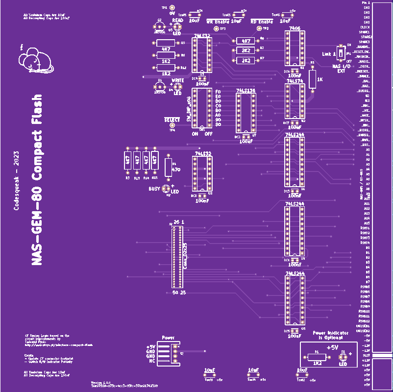
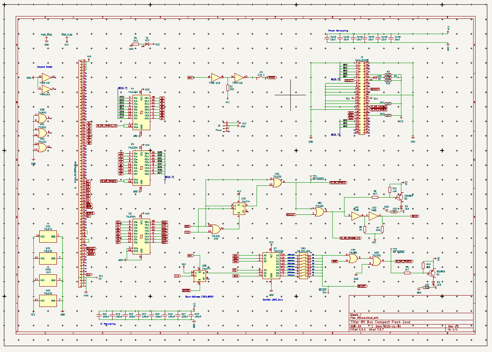

# NAS-GEM-80 Compact Flash Card 1.0

This card is to allow a compact flash module to be used in conjunction with an 80-Bus computer

## Introduction

The board is a standard 8x8 Nascom / Gemini / MAP-80 format card.  It features:

1. Port selection with a base between 0x80 and 0xF0
2. 8 bit operation in LBA mode (max 2**28 sectors, approximately 130GB )
3. An aux power connector for adaptors
4. Read / Write and Busy LED's

## Interface - A Brief overview

Addresses are offsets from the base address selected

| Address | Read | Write               |
|---------|------|---------------------|
| 0x00 | Data | Data                |
| 0x01 | Error Code  | Feature Select      |
| 0x02 | Sectors to Transfer | Sectors to Transfer |
| 0x03 | LBA 0..7 | LBA 0..7            |
| 0x04 | LBA 8..15 | LBA 8..15           |
| 0x05 | LBA 16..23 | LBA 16..23          |
| 0x06 | LBA 24..27 | LBA 16..23          |
| 0x07 | Status | Write Command       |

The following command sequences are sufficient to verify if a card if functional

### Select 8 Bit mode

Addresses are offsets from the base address selected

Write 0x01 to 0x01 - 8 bit mode

Write 0xEF to 0x07 - Set features

### Set Sector Count

Write 0x01 to 0x02 - Transfer one sector

### Select Sector to Read / Write

Write 0x01 to 0x03 - Select address 0x0000001

Write 0x00 to 0x04

Write 0x00 to 0x05

Write 0xE0 to 0x06

### Disable Cache

... otherwise your data won't stick !

Write 0x82 to 0x01 - Disable cache command

Write 0xEF to 0x07 - Set feature

### Read / Write

To read use the command 0x20, to write use the command 0x30 written to 0x07 and then read/write from
the data port 0x00

Between each byte you should check the status port to check if the next byte should be transferred.
However I have found the Z80 at 4MHz to be slow enough not to need this. YMMV

## Other

The CF card timing logic was adapted from a design by Tadeuzd Pycio

Details [Here](http://www.vtsys.pl/interface-compact-flash)

